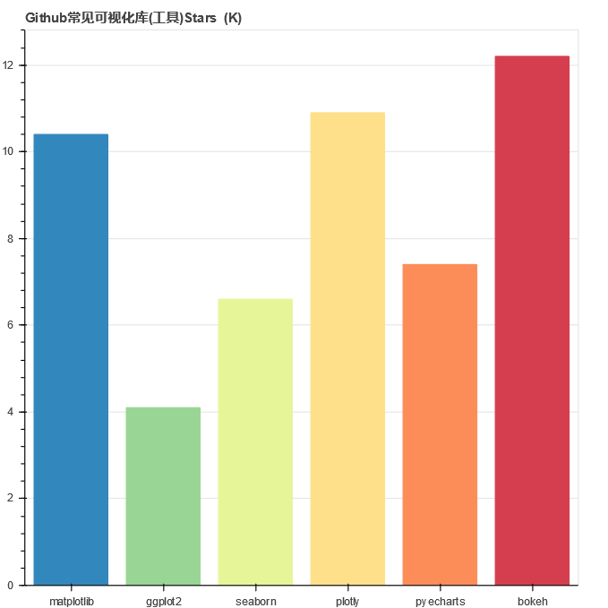

# bokeh_CN（bokeh 中文教程）  
## [购买通道](https://s.taobao.com/search?q=Bokeh) https://s.taobao.com/search?q=Bokeh  

Bokeh是基于D3.js强大的数据可视化库，用Django、Flask实现数据动态可视化，有效保证企业数据安全，当然，没图说个JB！下图数据采集于2019-12：

  
  

  
# 以下公众号，值得关注一波：）  
## 2019-12-01

## 2019-12-09 
### 恋习Python

## 2019-12-12  
### 马里奥玩python

